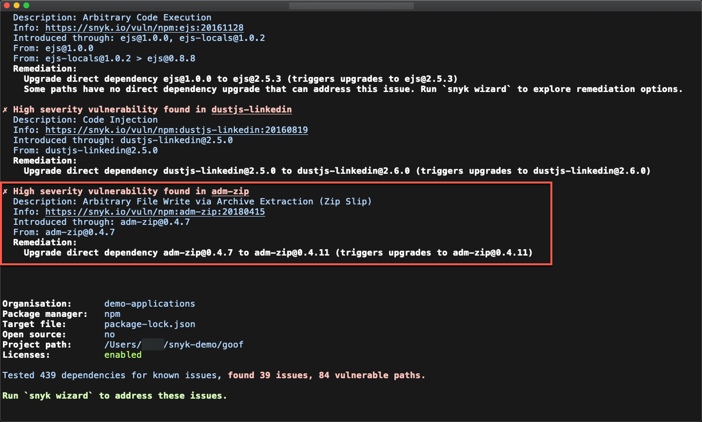
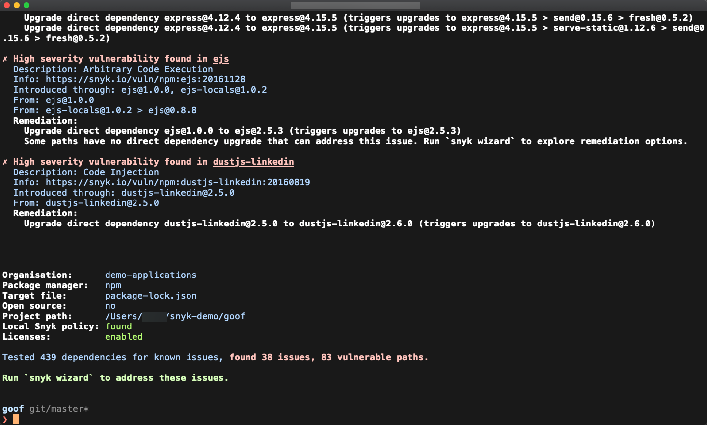

# How to ignore issues with the Snyk CLI

If you run `snyk test` or `snyk monitor` and find issues that you would like to ignore, you can use the `snyk ignore` command. This command will create or update a local file called `.snyk`. 

You might initially have results like:



Say you want to ignore the issue shown in the red box. You can do this by first noting the issue ID, which is this:


You would then run this command in order to ignore it:
```
snyk ignore --id=<issue-id>
```

In this specific example, it would be `snyk ignore --id=npm:adm-zip:20180415`

After this, you can see that a `.snyk` file has been created in the current directory. You can `cat` the file to see that the issue is now ignored:


You can now re-run your `snyk-test` command and see that the issue now does not appear:



This applies also to license issues.
